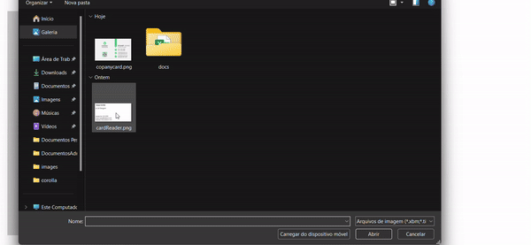

<h1 align="center">Business Card Processor</h1> 
<h2 align="center">About</h2> 
<h3 align="center">This project applies modern technologies like AI Builder and Power Automate to process business card images and automatically populate a form with the extracted information. Built with React and TypeScript, it demonstrates a practical integration of AI with automation tools to streamline data entry processes.</h3>

    

<h2>🚀 Technologies</h2>
<ul>
    <li><strong>React</strong>: JavaScript library for building user interfaces.</li>
    <li><strong>TypeScript</strong>: Strongly typed superset of JavaScript.</li>
    <li><strong>AI Builder</strong>: Power Platform tool for building AI models.</li>
    <li><strong>Power Automate</strong>: Automation service for creating workflows across applications.</li>
</ul>

<h2>🏗️ Architecture</h2>

This project leverages AI and automation to enhance business workflows. The AI model processes business card images, extracts key information, and Power Automate populates the appropriate form fields, providing an efficient and seamless data entry experience.

<h3>Features:</h3>
<ul>
    <li><strong>Image Processing</strong>: AI-driven image recognition for business cards.</li>
    <li><strong>Form Population</strong>: Automated data extraction and input into the form.</li>
    <li><strong>Responsive UI</strong>: Clean and intuitive interface built with React.</li>
    <li><strong>Automation Workflow</strong>: End-to-end automation using Power Automate.</li>
</ul>
